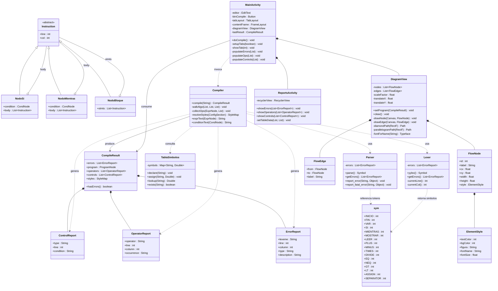

# Documentacion - Practica 1
## Organizacion de Lenguajes y Compiladores 1
### Centro Universitario de Occidente - USAC | Primer Semestre 2026

---

# MANUAL TECNICO

## 1. Organizacion del Proyecto

```
practica1/
├── app/
│   ├── build.gradle
│   └── src/
│       └── main/
│           ├── AndroidManifest.xml
│           ├── jflex/
│           │   └── Lexer.flex
│           ├── cup/
│           │   └── parser.cup
│           ├── java/
│           │   └── com/compiladores/practica1/
│           │       └── generated/
│           │           ├── Lexer.java       (auto-generado por JFlex)
│           │           ├── parser.java      (auto-generado por CUP)
│           │           └── sym.java         (auto-generado por CUP)
│           ├── kotlin/
│           │   └── com/compiladores/practica1/
│           │       ├── ast/
│           │       │   └── Nodes.kt
│           │       ├── compiler/
│           │       │   └── Compiler.kt
│           │       ├── flowchart/
│           │       │   └── FlowchartView.kt
│           │       ├── reports/
│           │       │   └── Reports.kt
│           │       └── ui/
│           │           └── MainActivity.kt
│           └── res/
│               ├── layout/
│               │   └── activity_main.xml
│               └── values/
│                   ├── colors.xml
│                   └── strings.xml
├── libs/
│   ├── jflex-full-1.9.1.jar
│   ├── java-cup-11b.jar
│   └── java-cup-11b-runtime.jar
├── scripts/
│   ├── setup.sh
│   └── generate.sh
├── build.gradle
├── settings.gradle
└── gradle.properties
```

### Descripcion de Archivos Principales

| Archivo | Descripcion |
|---|---|
| `Lexer.flex` | Especificacion JFlex: define tokens, estados y manejo de errores lexicos |
| `parser.cup` | Gramatica CUP: define reglas sintacticas, precedencia y construccion del AST |
| `Nodes.kt` | Jerarquia de nodos del AST: declaraciones, expresiones, condiciones |
| `Compiler.kt` | Fachada principal: ejecuta el pipeline lexico-sintactico y genera reportes |
| `FlowchartView.kt` | Vista Canvas con pan y zoom para renderizar el diagrama de flujo |
| `Reports.kt` | Modelos de datos para reportes de errores, operadores y estructuras de control |
| `MainActivity.kt` | Actividad principal: editor, boton compilar, TabLayout y RecyclerView |
| `build.gradle` | Configuracion Gradle con tareas `generateLexer` y `generateParser` |
| `setup.sh` | Script que descarga los JARs de JFlex y CUP |

---

## 2. Analisis de la Gramatica Lexica

### 2.1 Definiciones Base

| Nombre | Expresion Regular | Descripcion |
|---|---|---|
| `LineTerminator` | `\r\|\n\|\r\n` | Salto de linea |
| `WhiteSpace` | `[ \t\f] \| LineTerminator` | Espacios en blanco |
| `Comment` | `"#" [^\r\n]*` | Comentario de una linea |
| `IntLit` | `0 \| [1-9][0-9]*` | Literal entera sin signo |
| `DecLit` | `{IntLit}"."[0-9]+` | Literal decimal sin signo |
| `Identifier` | `[a-zA-Z_][a-zA-Z0-9_]*` | Nombre de variable |
| `StringLit` | `\"[^\"]*\"` | Cadena entre comillas dobles |
| `HexColor` | `H[0-9A-Fa-f]{6}` | Color hexadecimal con prefijo H |

### 2.2 Palabras Reservadas

| Token | Lexema | Descripcion |
|---|---|---|
| `INICIO` | `INICIO` | Marca el inicio del algoritmo |
| `FIN` | `FIN` | Marca el fin del algoritmo |
| `VAR` | `VAR` | Declaracion de variable |
| `SI` | `SI` | Estructura condicional |
| `ENTONCES` | `ENTONCES` | Cuerpo del SI |
| `FINSI` | `FINSI` | Cierre del SI (forma compacta) |
| `MIENTRAS` | `MIENTRAS` | Ciclo mientras |
| `HACER` | `HACER` | Cuerpo del MIENTRAS |
| `FINMIENTRAS` | `FINMIENTRAS` | Cierre del MIENTRAS (forma compacta) |
| `MOSTRAR` | `MOSTRAR` | Instruccion de salida |
| `LEER` | `LEER` | Instruccion de entrada |

> El lenguaje es **case sensitive**. Las palabras reservadas deben escribirse en mayusculas.

### 2.3 Operadores

| Token | Simbolo | Descripcion |
|---|---|---|
| `PLUS` | `+` | Suma |
| `MINUS` | `-` | Resta |
| `TIMES` | `*` | Multiplicacion |
| `DIVIDE` | `/` | Division |
| `ASSIGN` | `=` | Asignacion |
| `EQ` | `==` | Igualdad |
| `NEQ` | `!=` | Diferencia |
| `GT` | `>` | Mayor que |
| `LT` | `<` | Menor que |
| `GTE` | `>=` | Mayor o igual que |
| `LTE` | `<=` | Menor o igual que |
| `AND` | `&&` | Operador logico AND |
| `OR` | `\|\|` | Operador logico OR |
| `NOT` | `!` | Operador logico NOT |
| `PIPE` | `\|` | Separador valor/indice (seccion config) |
| `COMMA` | `,` | Separador de componentes RGB |

### 2.4 Tokens de Configuracion (Estado CONFIG)

Activos despues del separador `%%%%`:

| Token | Patron | Descripcion |
|---|---|---|
| `CFG_DEFAULT` | `%DEFAULT` | Estilo por defecto |
| `CFG_COLOR_TEXTO_SI` | `%COLOR_TEXTO_SI` | Color del texto del nodo SI |
| `CFG_COLOR_SI` | `%COLOR_SI` | Color de fondo del nodo SI |
| `CFG_FIGURA_SI` | `%FIGURA_SI` | Figura del nodo SI |
| `CFG_LETRA_SI` | `%LETRA_SI` | Fuente del nodo SI |
| `CFG_LETRA_SIZE_SI` | `%LETRA_SIZE_SI` | Tamano de fuente SI |
| `CFG_COLOR_TEXTO_MIENTRAS` | `%COLOR_TEXTO_MIENTRAS` | Color texto nodo MIENTRAS |
| `CFG_COLOR_MIENTRAS` | `%COLOR_MIENTRAS` | Color fondo nodo MIENTRAS |
| `CFG_FIGURA_MIENTRAS` | `%FIGURA_MIENTRAS` | Figura del nodo MIENTRAS |
| `CFG_LETRA_MIENTRAS` | `%LETRA_MIENTRAS` | Fuente del nodo MIENTRAS |
| `CFG_LETRA_SIZE_MIENTRAS` | `%LETRA_SIZE_MIENTRAS` | Tamano de fuente MIENTRAS |
| `CFG_COLOR_TEXTO_BLOQUE` | `%COLOR_TEXTO_BLOQUE` | Color texto nodo BLOQUE |
| `CFG_COLOR_BLOQUE` | `%COLOR_BLOQUE` | Color fondo nodo BLOQUE |
| `CFG_FIGURA_BLOQUE` | `%FIGURA_BLOQUE` | Figura del nodo BLOQUE |
| `CFG_LETRA_BLOQUE` | `%LETRA_BLOQUE` | Fuente del nodo BLOQUE |
| `CFG_LETRA_SIZE_BLOQUE` | `%LETRA_SIZE_BLOQUE` | Tamano de fuente BLOQUE |
| `FIGURA_NAME` | `CIRCULO\|ELIPSE\|ROMBO\|...` | Nombre de figura disponible |
| `LETRA_NAME` | `ARIAL\|VERDANA\|...` | Nombre de fuente disponible |
| `HEX_COLOR` | `H[0-9A-Fa-f]{6}` | Color en formato hexadecimal |

### 2.5 Manejo de Errores Lexicos

Cualquier caracter que no coincida con ningun patron en su estado activo genera un `ErrorReport` de tipo `Lexico` con el mensaje `Simbolo no existe en el lenguaje`, registrando lexema, linea y columna.

---

## 3. Analisis de la Gramatica Sintactica

### 3.1 Regla de Inicio

```
program ::= algo_section SEPARATOR config_section
```

### 3.2 Seccion de Algoritmo

```
algo_section ::= INICIO stmt_list FIN

stmt_list    ::= stmt_list stmt
               | stmt

stmt         ::= var_decl
               | assignment
               | if_stmt
               | while_stmt
               | show_stmt
               | read_stmt

var_decl     ::= VAR ID
               | VAR ID ASSIGN expr

assignment   ::= ID ASSIGN expr

if_stmt      ::= SI LPAREN condition RPAREN ENTONCES block FINSI
               | SI LPAREN condition RPAREN ENTONCES block FIN SI

while_stmt   ::= MIENTRAS LPAREN condition RPAREN HACER block FINMIENTRAS
               | MIENTRAS LPAREN condition RPAREN HACER block FIN MIENTRAS

block        ::= block_list

block_list   ::= block_list block_stmt
               | block_stmt

block_stmt   ::= var_decl
               | assignment
               | show_stmt
               | read_stmt

show_stmt    ::= MOSTRAR STRING
               | MOSTRAR expr

read_stmt    ::= LEER ID
```

> **Restriccion:** Los nodos `if_stmt` y `while_stmt` solo aceptan `block_stmt` en su cuerpo. `block_stmt` no incluye `if_stmt` ni `while_stmt`, lo que impide la anidacion de ciclos y condiciones a nivel gramatical.

### 3.3 Expresiones Aritmeticas

```
expr   ::= expr PLUS  term
         | expr MINUS term
         | term

term   ::= term TIMES  factor
         | term DIVIDE factor
         | factor

factor ::= INTEGER
         | DECIMAL
         | ID
         | LPAREN expr RPAREN
         | MINUS factor
```

### 3.4 Condiciones

```
condition ::= expr EQ  expr
            | expr NEQ expr
            | expr GT  expr
            | expr LT  expr
            | expr GTE expr
            | expr LTE expr
            | condition AND condition
            | condition OR  condition
            | NOT condition
            | LPAREN condition RPAREN
```

### 3.5 Seccion de Configuracion

```
config_section ::= config_list

config_list    ::= config_list config_instr
                 | config_instr

config_instr   ::= CFG_DEFAULT       ASSIGN num_expr
                 | CFG_COLOR_TEXTO_SI ASSIGN color_value PIPE num_expr
                 | CFG_COLOR_SI       ASSIGN color_value PIPE num_expr
                 | CFG_FIGURA_SI      ASSIGN FIGURA_NAME PIPE num_expr
                 | CFG_LETRA_SI       ASSIGN LETRA_NAME  PIPE num_expr
                 | CFG_LETRA_SIZE_SI  ASSIGN num_expr    PIPE num_expr
                 | ... (misma estructura para MIENTRAS y BLOQUE)

color_value    ::= num_expr COMMA num_expr COMMA num_expr
                 | HEX_COLOR

num_expr       ::= num_expr PLUS  num_term
                 | num_expr MINUS num_term
                 | num_term

num_term       ::= num_term TIMES  num_factor
                 | num_term DIVIDE num_factor
                 | num_factor

num_factor     ::= INTEGER
                 | DECIMAL
                 | LPAREN num_expr RPAREN
                 | MINUS num_factor
```

### 3.6 Precedencia de Operadores (de menor a mayor)

| Nivel | Operadores | Asociatividad |
|---|---|---|
| 1 | `\|\|` | Izquierda |
| 2 | `&&` | Izquierda |
| 3 | `!` | Derecha (unario) |
| 4 | `+ -` | Izquierda |
| 5 | `* /` | Izquierda |
| 6 | `- (unario)` | Derecha (`%prec UMINUS`) |

### 3.7 Manejo de Errores Sintacticos

El parser CUP invoca `report_error` en cada error de reduccion o desplazamiento. Cada llamada genera un `ErrorReport` de tipo `Sintactico` con el simbolo, linea, columna y descripcion del error. La compilacion continua para reportar multiples errores en una sola pasada.

---

## 4. Diagrama de Clases UML



---

---

# MANUAL DE USUARIO

## 1. Descripcion de la Aplicacion

La aplicacion Android **Compiladores Practica 1** permite ingresar pseudocodigo en un lenguaje definido, compilarlo y visualizar el diagrama de flujo equivalente junto con reportes de operadores matematicos, estructuras de control y errores de compilacion.

---

## 2. Requisitos Previos

- Dispositivo Android con version **Android 8.0 (API 26) o superior**
- El archivo APK instalado o la aplicacion ejecutada desde Android Studio
- Para desarrollo: Android Studio Panda 2025.3.1 Patch 1 con JDK 17+

---

## 3. Compilar y Ejecutar el Proyecto en Android Studio

### Paso 1: Descargar las dependencias

Antes de abrir el proyecto por primera vez, ejecutar el script de configuracion desde una terminal:

```bash
cd practica1/scripts
chmod +x setup.sh
./setup.sh
```

Este script descarga automaticamente los tres JARs necesarios en la carpeta `libs/`:
- `jflex-full-1.9.1.jar`
- `java-cup-11b.jar`
- `java-cup-11b-runtime.jar`

### Paso 2: Abrir el proyecto

1. Abrir **Android Studio**.
2. Seleccionar **Open** y navegar hasta la carpeta `practica1/`.
3. Esperar a que Gradle sincronice el proyecto.
4. Durante la sincronizacion, Gradle ejecuta automaticamente las tareas `generateLexer` y `generateParser`, que generan los archivos `Lexer.java`, `parser.java` y `sym.java` en `app/src/main/java/.../generated/`.

### Paso 3: Conectar el dispositivo fisico

1. Conectar el dispositivo Android via **cable USB**.
2. Activar **Opciones de desarrollador** en el dispositivo (Ajustes > Acerca del telefono > tocar 7 veces el numero de compilacion).
3. Activar **Depuracion USB**.
4. Confirmar la autorizacion en el dispositivo cuando aparezca el dialogo.

### Paso 4: Ejecutar la aplicacion

1. En Android Studio, seleccionar el dispositivo fisico en el selector de dispositivos.
2. Hacer clic en el boton **Run (triangulo verde)** o presionar `Shift+F10`.
3. La aplicacion se instalara y se abrira automaticamente en el dispositivo.

### Regenerar el lexico y el parser manualmente (opcional)

```bash
cd practica1/scripts
./generate.sh
```

---

## 4. Uso de la Interfaz

### 4.1 Pantalla principal

La interfaz se divide en dos zonas:

| Zona | Descripcion |
|---|---|
| **Editor superior** | Campo de texto editable donde se escribe el pseudocodigo y la seccion de configuracion |
| **Area de resultados inferior** | Muestra el diagrama de flujo o los reportes segun el resultado de la compilacion |

### 4.2 Ingresar pseudocodigo

1. Tocar el **area del editor** en la parte superior de la pantalla.
2. Escribir el pseudocodigo siguiendo la estructura del lenguaje.
3. Despues del bloque del algoritmo, escribir el separador `%%%%` en una linea propia.
4. A continuacion escribir la seccion de configuracion.

**Estructura obligatoria del archivo de entrada:**

```
INICIO
    [instrucciones]
FIN
%%%%
[instrucciones de configuracion]
```

### 4.3 Compilar

1. Presionar el boton **COMPILAR** ubicado debajo del editor.
2. El sistema ejecuta el analisis lexico y sintactico.
3. El resultado se muestra en el area inferior.

---

## 5. Reportes Generados

### 5.1 Cuando hay errores de compilacion

Si existen errores lexicos o sintacticos, la aplicacion muestra **unicamente** la pestana **Errores**:

| Columna | Descripcion |
|---|---|
| Lexema | El texto que causo el error |
| Linea | Numero de linea donde ocurrio |
| Columna | Posicion en la linea |
| Tipo | `Lexico` o `Sintactico` |
| Descripcion | Mensaje descriptivo del error |

### 5.2 Cuando la compilacion es exitosa

Si no hay errores, se muestran tres pestanas:

#### Pestana "Diagrama"
Muestra el diagrama de flujo interactivo generado a partir del AST:
- **Pellizcar** para hacer zoom in/out.
- **Arrastrar** para navegar (pan).
- Las figuras y colores reflejan la configuracion de la seccion `%%%%`.

#### Pestana "Operadores"
Tabla con cada operador aritmetico encontrado:

| Operador | Linea | Columna | Ocurrencia |
|---|---|---|---|
| Suma | 3 | 14 | a + 1 |
| Division | 5 | 20 | 25 / 2 |

#### Pestana "Control"
Tabla con cada estructura de control encontrada:

| Objeto | Linea | Condicion |
|---|---|---|
| SI | 4 | a < b |
| MIENTRAS | 8 | a < 15 |

---

## 6. Condiciones para Visualizar el Diagrama de Flujo

El diagrama de flujo **solo se muestra si la compilacion no produce errores**. Si existe al menos un error lexico o sintactico:

- Solo la pestana **Errores** estara activa.
- Las pestanas **Diagrama**, **Operadores** y **Control** no apareceran.

Una vez corregidos todos los errores y recompilado, el diagrama y los reportes estaran disponibles.

---

## 7. Lenguaje Soportado

### 7.1 Instrucciones disponibles

| Instruccion | Sintaxis | Descripcion |
|---|---|---|
| Declaracion | `VAR nombre` | Declara una variable numerica |
| Declaracion con valor | `VAR nombre = expresion` | Declara e inicializa |
| Asignacion | `nombre = expresion` | Asigna un valor a una variable existente |
| Condicional | `SI (cond) ENTONCES ... FINSI` | Estructura if |
| Ciclo | `MIENTRAS (cond) HACER ... FINMIENTRAS` | Estructura while |
| Salida | `MOSTRAR "texto"` o `MOSTRAR variable` | Muestra un valor |
| Entrada | `LEER variable` | Lee un valor para la variable |
| Comentario | `# texto libre` | Linea ignorada por el compilador |

### 7.2 Operadores aritmeticos

| Operador | Descripcion | Precedencia |
|---|---|---|
| `+` | Suma | 1 (menor) |
| `-` | Resta | 1 |
| `*` | Multiplicacion | 2 |
| `/` | Division | 2 |
| `( )` | Parentesis | 3 (mayor) |

### 7.3 Operadores relacionales y logicos

`==`  `!=`  `>`  `<`  `>=`  `<=`  `&&`  `||`  `!`

### 7.4 Figuras disponibles para el diagrama

`ELIPSE` `CIRCULO` `PARALELOGRAMO` `RECTANGULO` `ROMBO` `RECTANGULO_REDONDEADO`

### 7.5 Fuentes disponibles

`ARIAL` `TIMES_NEW_ROMAN` `COMIC_SANS` `VERDANA`

---

## 8. Ejemplo Completo de Entrada y Salida

### Entrada

```
# Programa de ejemplo
INICIO
    VAR a = 10
    VAR b = 20
    SI (a < b) ENTONCES
        MOSTRAR "a es menor que b"
    FINSI
    MIENTRAS (a < 15) HACER
        a = a + 1
        MOSTRAR a
    FINMIENTRAS
    MOSTRAR "Fin del programa"
FIN
%%%%
%DEFAULT=1
%COLOR_TEXTO_SI=12,45-5,1|1
%FIGURA_MIENTRAS=CIRCULO|1
%DEFAULT=3
```

### Salida esperada (sin errores)

**Pestana Diagrama:**

El canvas muestra los nodos en el siguiente orden vertical:

```
[ELIPSE] INICIO
    |
[RECTANGULO] VAR a = 10
    |
[RECTANGULO] VAR b = 20
    |
[ROMBO] SI  a < b
    |            |
    | (SI)      (NO)
    |             |
[PARALELOGRAMO]   |
MOSTRAR "a..."    |
    |             |
    +------+------+
           |
[ROMBO] MIENTRAS  a < 15
    |                   |
    | (SI)             (NO)
    |                   |
[RECTANGULO]            |
a = a + 1               |
    |                   |
[PARALELOGRAMO]         |
MOSTRAR a               |
    |                   |
    +----(retorno)  +---+
                    |
[PARALELOGRAMO]
MOSTRAR "Fin del programa"
    |
[ELIPSE] FIN
```

**Pestana Operadores:**

| Operador | Linea | Columna | Ocurrencia |
|---|---|---|---|
| Suma | 9 | 13 | a + 1 |

**Pestana Control:**

| Objeto | Linea | Condicion |
|---|---|---|
| SI | 5 | a < b |
| MIENTRAS | 8 | a < 15 |

### Ejemplo con error lexico

**Entrada:**

```
INICIO
    VAR a = 10$
FIN
%%%%
%DEFAULT=1
```

**Salida (solo pestana Errores):**

| Lexema | Linea | Columna | Tipo | Descripcion |
|---|---|---|---|---|
| `$` | 2 | 15 | Lexico | Simbolo no existe en el lenguaje |

---

## 9. Preguntas Frecuentes

**El diagrama no aparece despues de compilar.**
Verificar que no existan errores en la pestana Errores. El diagrama solo se muestra cuando la compilacion es completamente exitosa.

**La aplicacion no genera los archivos Lexer.java o parser.java.**
Ejecutar `scripts/setup.sh` para descargar los JARs y luego realizar un Clean + Rebuild en Android Studio.

**El texto del pseudocodigo no es reconocido.**
Verificar que las palabras reservadas esten en mayusculas (`INICIO`, `FIN`, `VAR`, etc.) ya que el lenguaje es case sensitive.

**Los ciclos y condiciones no se pueden anidar.**
Esta es una restriccion del lenguaje. El cuerpo de un `SI` o `MIENTRAS` solo acepta declaraciones, asignaciones, `MOSTRAR` y `LEER`.
